# Tutorial Passo a Passo: Scaffold DB-First no Visual Studio 2022

Este tutorial orienta como gerar uma aplicação Web conectada a um banco de dados SQL Server já existente (*Database-First*) utilizando o **Visual Studio 2022** e o **Entity Framework Core**.

> **Objetivo Pedagógico**: O propósito desta prática é permitir que você veja uma aplicação real interagindo com o seu banco de dados (testando inserções, consultas, violações de chave estrangeira, ações de deleção em cascata e disparo de triggers) **através de telas visuais geradas automaticamente, sem necessidade de programar código C#**.

---

## Sumário
1. [Pré-requisitos](#1-pré-requisitos)
2. [Passo 1: Criação da Base de Dados no SQL Server (SSMS)](#passo-1-criação-da-base-de-dados-no-sql-server-ssms)
3. [Passo 2: Criação do Projeto no Visual Studio 2022](#passo-2-criação-do-projeto-no-visual-studio-2022)
4. [Passo 3: Instalação dos Pacotes NuGet Necessários](#passo-3-instalação-dos-pacotes-nuget-necessários)
5. [Passo 4: Configuração da String de Conexão (appsettings.json)](#passo-4-configuração-da-string-de-conexão-appsettingsjson)
6. [Passo 5: Engenharia Reversa do Banco (Scaffold-DbContext)](#passo-5-engenharia-reversa-do-banco-scaffold-dbcontext)
7. [Passo 6: Registro do Banco de Dados no Program.cs](#passo-6-registro-do-banco-de-dados-no-programcs)
8. [Passo 7: Geração Automática das Telas e Controladores (Scaffold)](#passo-7-geração-automática-das-telas-e-controladores-scaffold)
9. [Passo 8: Execução e Testes Práticos no Navegador](#passo-8-execução-e-testes-práticos-no-navegador)

---

## 1. Pré-requisitos

Antes de iniciar, certifique-se de que seu computador possui instalado:
- **SQL Server LocalDB** (geralmente instalado junto com o Visual Studio ou SQL Server Express).
- **SQL Server Management Studio (SSMS)**.
- **Visual Studio 2022** (com a carga de trabalho *"ASP.NET e desenvolvimento Web"* instalada).

---

## Passo 1: Criação da Base de Dados no SQL Server (SSMS)

1. Abra o **SQL Server Management Studio (SSMS)**.
2. Na janela de conexão, informe:
   - **Tipo de servidor**: `Mecanismo de Banco de Dados`
   - **Nome do servidor**: `(localdb)\MSSQLLocalDB`
   - **Autenticação**: `Autenticação do Windows`
   - Clique em **Conectar**.

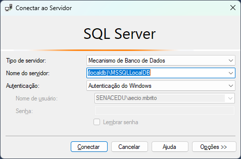

3. No **Pesquisador de Objetos**, clique com o botão direito na pasta **Bancos de Dados** ou clique no botão **Nova Consulta** na barra superior.

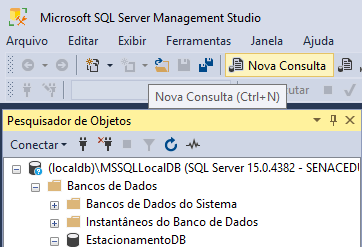

4. Digite e execute o seguinte script T-SQL para criar o banco de dados `EstacionamentoDB` e suas tabelas:

```sql
CREATE DATABASE EstacionamentoDB;
GO

USE EstacionamentoDB;
GO

CREATE TABLE Clientes (
    id INT IDENTITY(1,1) PRIMARY KEY,
    nome VARCHAR(100) NOT NULL,
    cpf VARCHAR(14) NOT NULL UNIQUE,
    telefone VARCHAR(20) NULL
);
GO

CREATE TABLE Vagas (
    id INT IDENTITY(1,1) PRIMARY KEY,
    localizacao VARCHAR(50) NOT NULL,
    tipo VARCHAR(20) NULL
);
GO

CREATE TABLE Veiculos (
    id INT IDENTITY(1,1) PRIMARY KEY,
    cliente_id INT NOT NULL,
    placa VARCHAR(10) NOT NULL UNIQUE,
    modelo VARCHAR(50) NULL,
    cor VARCHAR(30) NULL,
    CONSTRAINT FK_Veiculo_Cliente
        FOREIGN KEY (cliente_id) REFERENCES Clientes (id)
        ON DELETE CASCADE
);
GO

CREATE TABLE RegistrosEstacionamento (
    id INT IDENTITY(1,1) PRIMARY KEY,
    veiculo_id INT NOT NULL,
    vaga_id INT NOT NULL,
    data_hora_entrada DATETIME NOT NULL,
    data_hora_saida DATETIME NULL,
    valor_total DECIMAL(10,2) NULL,
    CONSTRAINT FK_Registro_Veiculo
        FOREIGN KEY (veiculo_id) REFERENCES Veiculos (id),
    CONSTRAINT FK_Registro_Vaga
        FOREIGN KEY (vaga_id) REFERENCES Vagas (id)
);
GO
```

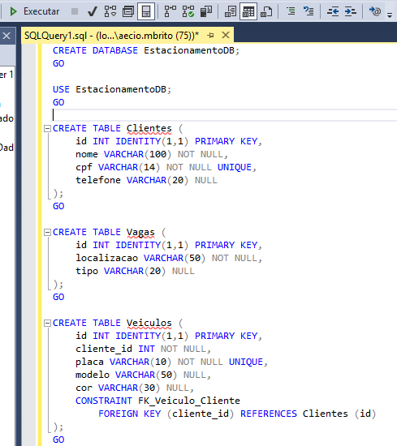

5. Atualize o Pesquisador de Objetos (`F5`) e confirme que as 4 tabelas foram criadas com sucesso dentro de `EstacionamentoDB`:
   - `dbo.Clientes`
   - `dbo.Vagas`
   - `dbo.Veiculos`
   - `dbo.RegistrosEstacionamento`

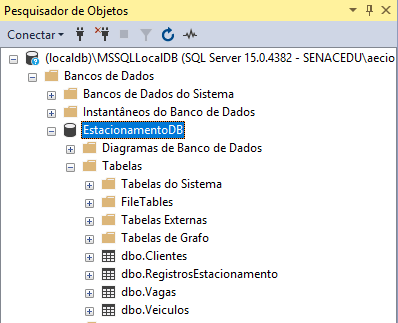

---

## Passo 2: Criação do Projeto no Visual Studio 2022

1. Abra o **Visual Studio 2022**. Na tela inicial, clique na opção **Criar um projeto**.

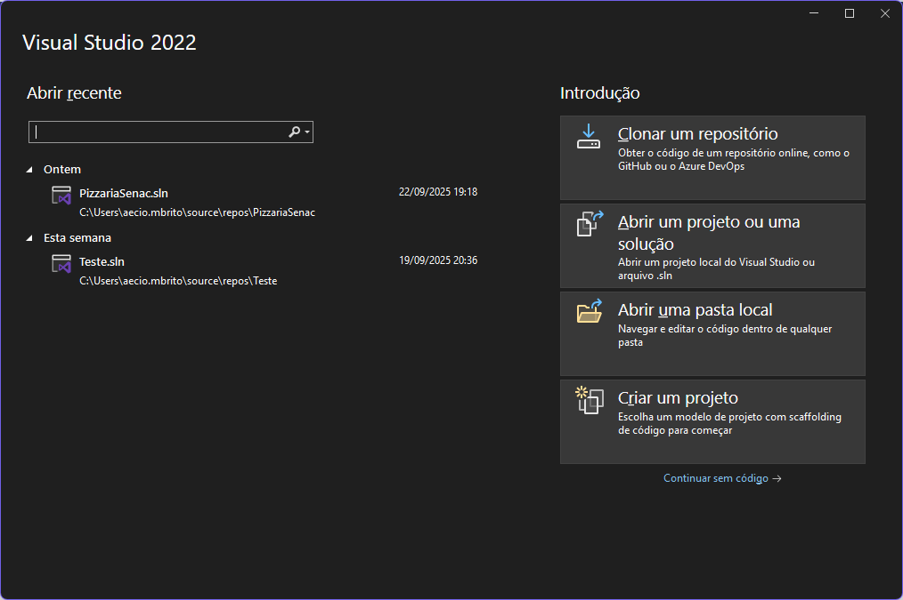

2. No campo de busca superior, digite `Model-View` e selecione o modelo:
   - **Aplicativo Web do ASP.NET Core (Model-View-Controller)** com linguagem **C#**.
   - Clique em **Próximo**.

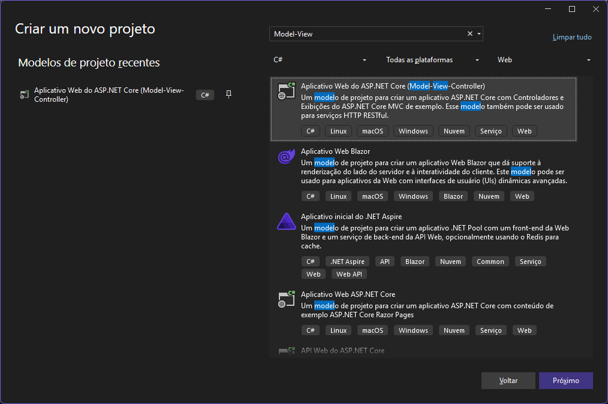

3. Na tela de configuração:
   - **Nome do projeto**: `EstacionamentoWeb`
   - **Local**: Mantenha o padrão ou escolha sua pasta de trabalho (ex: `C:\Users\...\source\repos`).
   - Clique em **Próximo**.

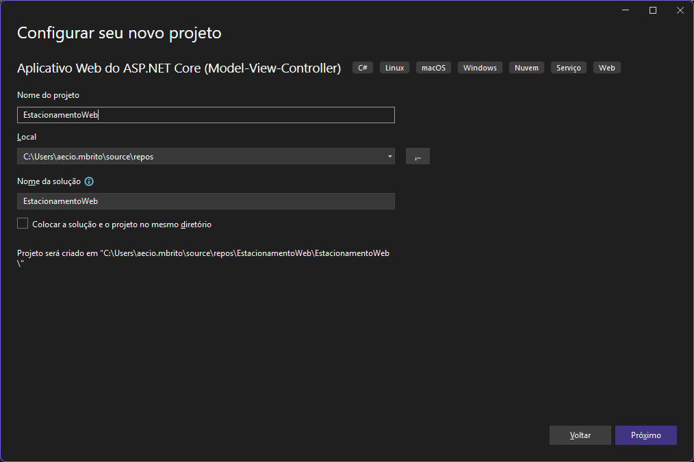

4. Na tela de **Informações adicionais**:
   - **Estrutura**: `.NET 8.0 (Suporte de Longo Prazo)`
   - **Tipo de autenticação**: `Nenhum`
   - **Configurar para HTTPS**: Deixe marcado.
   - Clique em **Criar**.

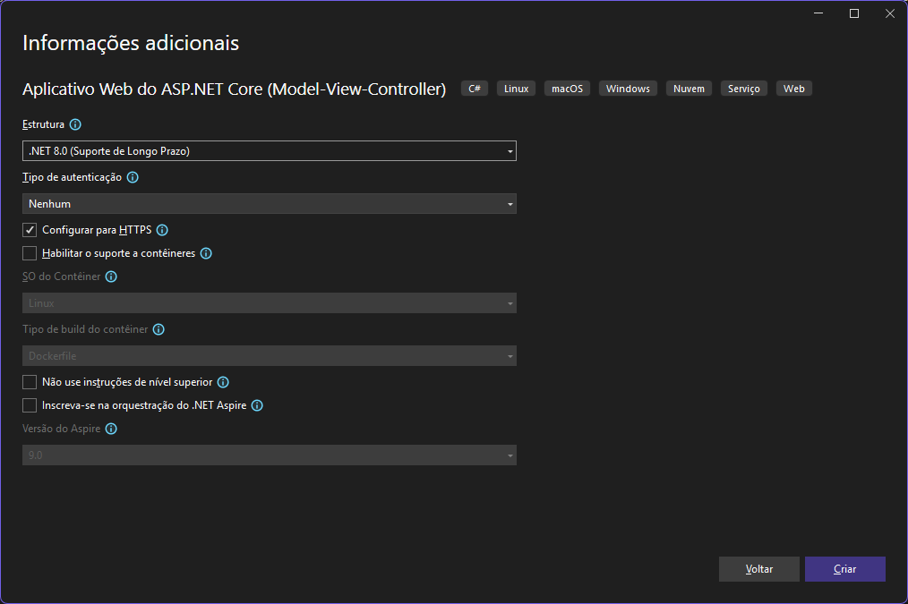

---

## Passo 3: Instalação dos Pacotes NuGet Necessários

Para que o Visual Studio consiga se comunicar com o SQL Server e gerar o código automaticamente, precisamos instalar 3 pacotes oficiais da Microsoft:

1. No menu superior do Visual Studio, acesse:
   - **Ferramentas** > **Gerenciador de Pacotes do NuGet** > **Gerenciar Pacotes do NuGet para a Solução...**

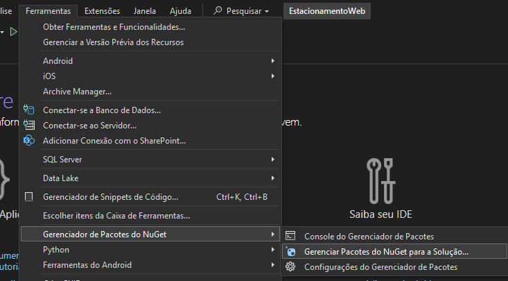

2. Clique na aba **Procurar** e instale cada um dos pacotes abaixo (marque a caixa de seleção do projeto `EstacionamentoWeb` à direita e selecione a versão correspondente ao .NET 8, como `8.0.20`):

   - **Pacote 1**: `Microsoft.EntityFrameworkCore.SqlServer`
     *(Provedor de acesso ao banco SQL Server)*
     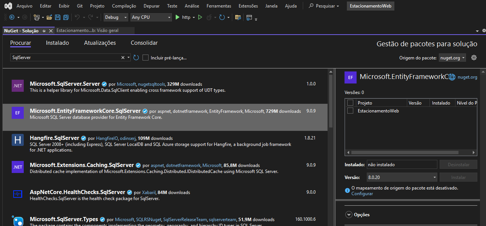

   - **Pacote 2**: `Microsoft.EntityFrameworkCore.Tools`
     *(Ferramentas de console para comandos do EF Core)*
     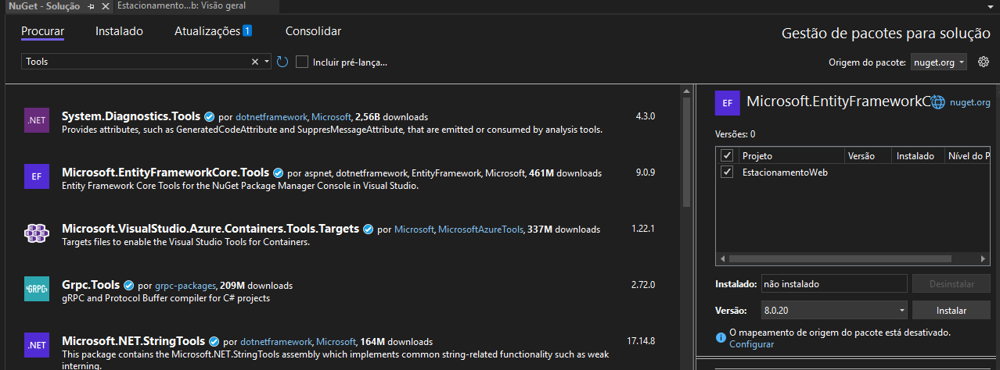

   - **Pacote 3**: `Microsoft.VisualStudio.Web.CodeGeneration.Design`
     *(Mecanismo de scaffold visual de telas e controladores)*
     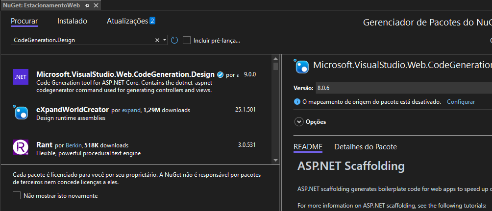

3. Na aba **Instalado**, confirme se os 3 pacotes aparecem listados:

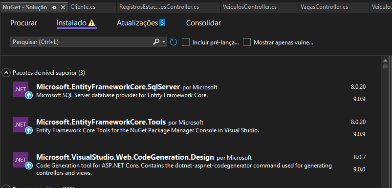

---

## Passo 4: Configuração da String de Conexão (appsettings.json)

1. No **Gerenciador de Soluções** (à direita), localize e abra o arquivo `appsettings.json`.

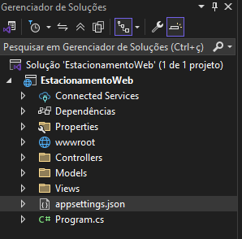

2. Adicione a chave `"ConnectionStrings"` apontando para o seu banco `EstacionamentoDB`:

```json
{
  "Logging": {
    "LogLevel": {
      "Default": "Information",
      "Microsoft.AspNetCore": "Warning"
    }
  },
  "AllowedHosts": "*",
  "ConnectionStrings": {
    "EstacionamentoWebContext": "Server=(localdb)\\mssqllocalDB;Database=EstacionamentoDB;Trusted_Connection=True;MultipleActiveResultSets=true;TrustServerCertificate=True;"
  }
}
```

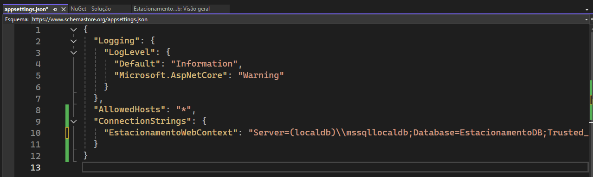

---

## Passo 5: Engenharia Reversa do Banco (Scaffold-DbContext)

Agora faremos a leitura automática das tabelas do SQL Server para gerar as classes de modelo (Models) e a classe de contexto (`EstacionamentoDbContext`).

1. No menu superior, vá em:
   - **Ferramentas** > **Gerenciador de Pacotes do NuGet** > **Console do Gerenciador de Pacotes**.
2. Na linha de comando aberta na parte inferior, cole o comando abaixo e pressione `Enter`:

```powershell
Scaffold-DbContext "Server=(localdb)\MSSQLLocalDB;Database=EstacionamentoDB;Trusted_Connection=True;TrustServerCertificate=True;" Microsoft.EntityFrameworkCore.SqlServer -OutputDir Models
```

3. O Visual Studio irá ler o banco e criará automaticamente dentro da pasta `Models/`:
   - `Cliente.cs`
   - `Vaga.cs`
   - `Veiculo.cs`
   - `RegistrosEstacionamento.cs`
   - `EstacionamentoDbContext.cs`

---

## Passo 6: Registro do Banco de Dados no Program.cs

1. No Gerenciador de Soluções, abra o arquivo `Program.cs`.
2. No topo do arquivo, adicione as referências aos pacotes e aos modelos:

```csharp
using Microsoft.EntityFrameworkCore;
using EstacionamentoWeb.Models;
```

3. Logo abaixo da linha `var builder = WebApplication.CreateBuilder(args);`, adicione a injeção do banco:

```csharp
var connectionString = builder.Configuration.GetConnectionString("EstacionamentoWebContext");
builder.Services.AddDbContext<EstacionamentoDbContext>(options =>
    options.UseSqlServer(connectionString));
```

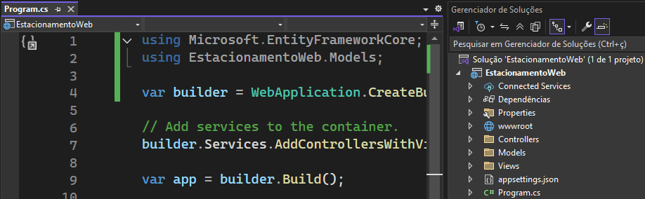

---

## Passo 7: Geração Automática das Telas e Controladores (Scaffold)

Com os modelos gerados e o contexto registrado, podemos gerar as telas de cadastro (CRUD) visualmente:

1. No Gerenciador de Soluções, clique com o botão direito na pasta **Controllers**.
2. Selecione **Adicionar** > **Novo Item com Scaffold...**
3. Na janela que surgir:
   - Escolha **Controlador MVC com exibições, usando o Entity Framework**.
   - Clique em **Adicionar**.
4. No formulário de geração:
   - **Classe de modelo**: Selecione `Cliente (EstacionamentoWeb.Models)`.
   - **Classe de contexto de dados**: Selecione `EstacionamentoDbContext (EstacionamentoWeb.Models)`.
   - Clique em **Adicionar**.
5. O Visual Studio gerará o `ClientesController.cs` e todas as páginas HTML/Razor de visualização dentro de `Views/Clientes/` (`Index`, `Create`, `Edit`, `Details`, `Delete`).
6. **Repita o mesmo procedimento** para as outras entidades:
   - `Vaga`
   - `Veiculo`
   - `RegistrosEstacionamento`

Ao término, você terá todos os controladores gerados na sua solução:

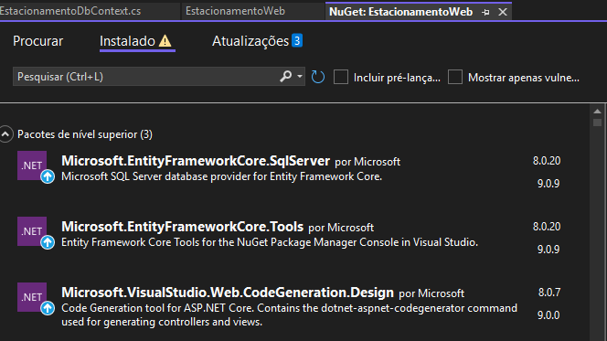

---

## Passo 8: Execução e Testes Práticos no Navegador

1. Pressione `F5` ou clique no botão verde com o nome do projeto para executar a aplicação.
2. Seu navegador abrirá a página inicial da aplicação Web.
3. Para acessar os cadastros, basta navegar pelas rotas no navegador:
   - `https://localhost:PORTA/Clientes`
   - `https://localhost:PORTA/Vagas`
   - `https://localhost:PORTA/Veiculos`
   - `https://localhost:PORTA/RegistrosEstacionamento`

### O que observar durante os testes de banco de dados:

1. **Integridade de Chave Única (UNIQUE)**:
   - Tente cadastrar dois clientes com o mesmo CPF ou dois veículos com a mesma placa. Observe como o banco de dados rejeita a operação com erro de integridade referencial.
2. **Deleção em Cascata (`ON DELETE CASCADE`)**:
   - Cadastre um cliente e dois veículos associados a ele.
   - Exclua o cliente e vá na tela de veículos: note que os veículos foram removidos automaticamente por causa da regra definida no banco.
3. **Restrição de Integridade (`ON DELETE RESTRICT`)**:
   - Tente excluir uma vaga que possui um registro histórico de estacionamento. O banco de dados bloqueará a exclusão para preservar o histórico.
4. **Validação de Triggers e Procedures**:
   - Caso você tenha criado triggers de ocupação de vaga no banco, registre uma entrada de veículo pela página web e consulte o banco para comprovar que a vaga mudou seu status para 'Ocupada' sem que a aplicação precisasse fazer isso manualmente!
