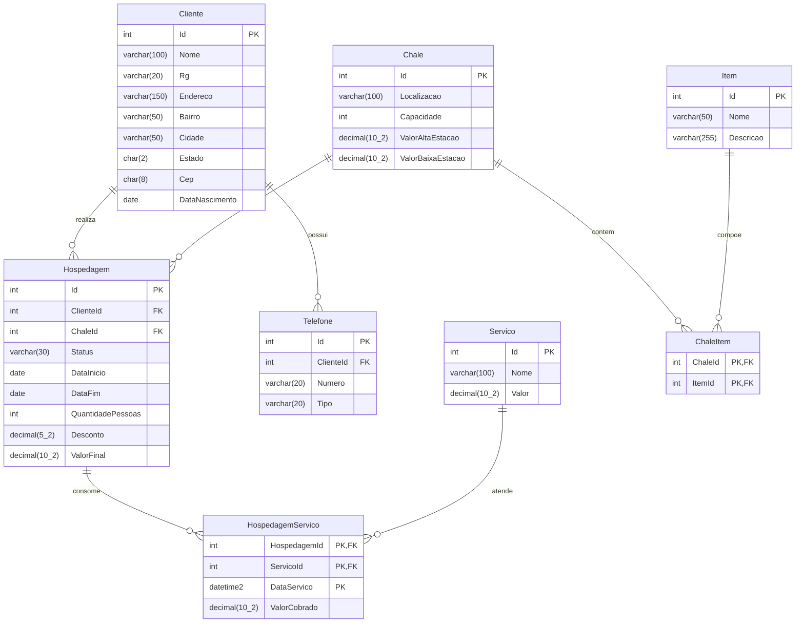

```mermaid
erDiagram
    Cliente ||--o{ Hospedagem : realiza
    Cliente ||--o{ Telefone : possui
    Chale ||--o{ Hospedagem : alocado
    Hospedagem ||--o{ HospedagemServico : consome
    Servico ||--o{ HospedagemServico : atende
    Chale ||--o{ ChaleItem : contem
    Item ||--o{ ChaleItem : compoe

    Cliente {
        int Id PK
        varchar(100) Nome
        varchar(20) Rg
        varchar(150) Endereco
        varchar(50) Bairro
        varchar(50) Cidade
        char(2) Estado
        char(8) Cep
        date DataNascimento
    }

    Telefone {
        int Id PK
        int ClienteId FK
        varchar(20) Numero
        varchar(20) Tipo
    }

    Chale {
        int Id PK
        varchar(100) Localizacao
        int Capacidade
        decimal(10_2) ValorAltaEstacao
        decimal(10_2) ValorBaixaEstacao
    }

    Item {
        int Id PK
        varchar(50) Nome
        varchar(255) Descricao
    }

    ChaleItem {
        int ChaleId PK,FK
        int ItemId PK,FK
    }

    Hospedagem {
        int Id PK
        int ClienteId FK
        int ChaleId FK
        varchar(30) Status
        date DataInicio
        date DataFim
        int QuantidadePessoas
        decimal(5_2) Desconto
        decimal(10_2) ValorFinal
    }

    Servico {
        int Id PK
        varchar(100) Nome
        decimal(10_2) Valor
    }

    HospedagemServico {
        int HospedagemId PK,FK
        int ServicoId PK,FK
        datetime2 DataServico PK
        decimal(10_2) ValorCobrado
    }
```